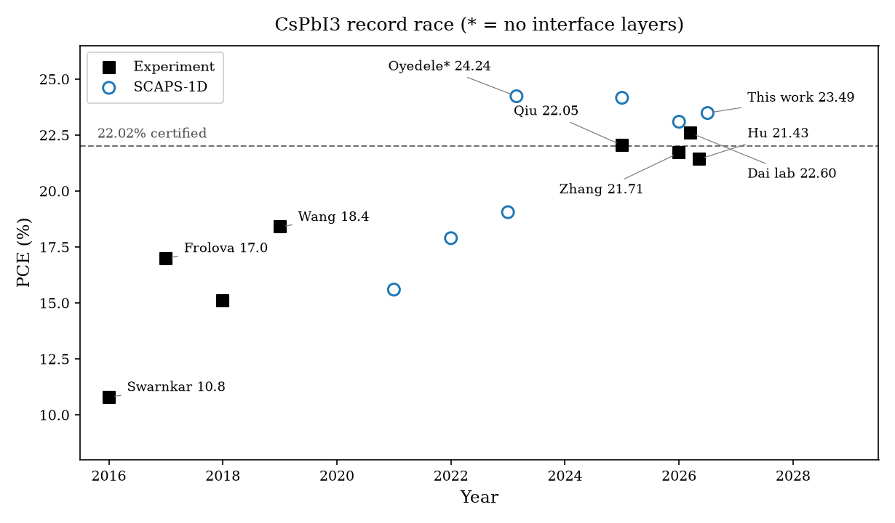
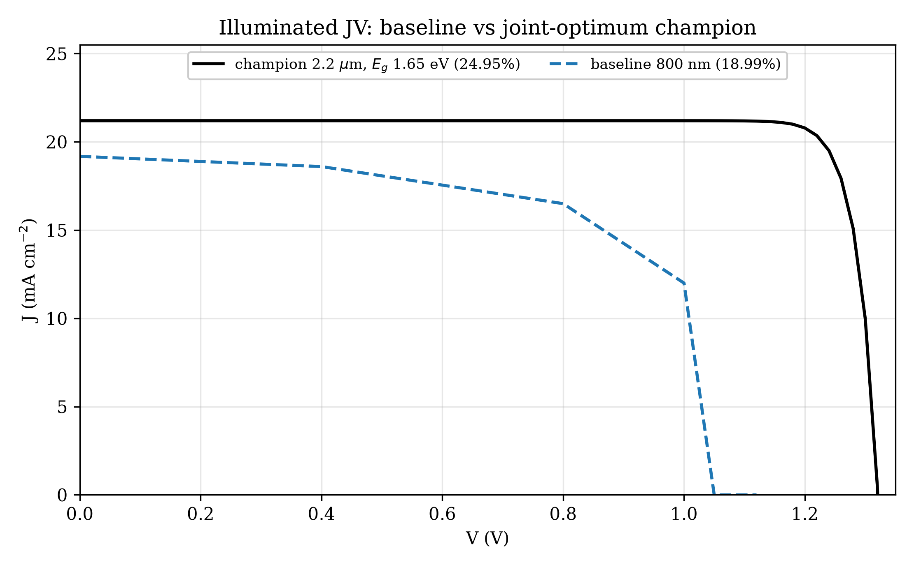
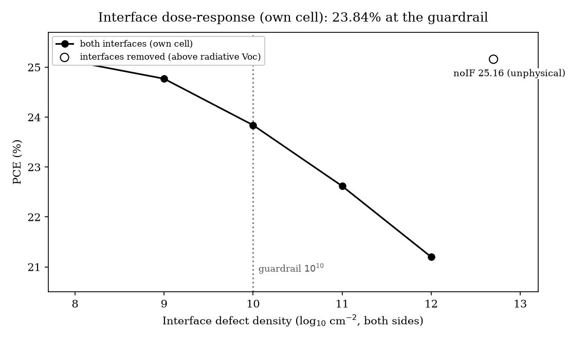
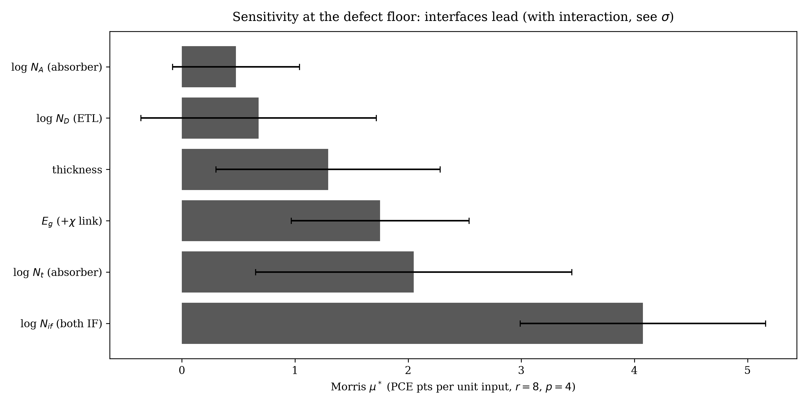
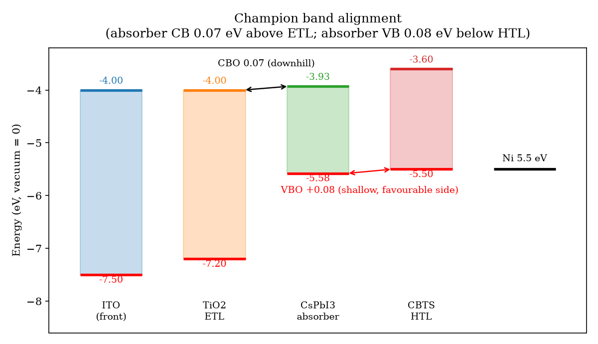

# A Guardrailed 23.5%-Efficient CsPbI₃ Constrained Maximum

SCAPS-1D screening of an ITO/TiO₂/CsPbI₃/CBTS/Ni cell: best point in a
stated box (23.49%), every load-bearing assumption priced, realistic-settings
result (20.68%), interface dose–response, scripted parasitics, and Morris
sensitivity — with a reproducibility audit of published 24%+ claims.

**Manuscript:** [`manuscript/document.tex`](manuscript/document.tex) →
[`drafts/draft-jbss-r5.pdf`](drafts/draft-jbss-r5.pdf)

## Record race: experiment vs simulation



Black squares are certified/laboratory experiments; open circles are SCAPS-1D.
Every recent experimental jump came from defect and interface control — the
exact levers this study treats honestly, with interfaces switched on.

## Champion device (best point in the stated box)

2.2 µm absorber, N_A 3×10¹⁶ cm⁻³, N_t 10¹² cm⁻³ (single-crystal grade),
E_g 1.65 eV, R_s = 0, 10¹⁰ cm⁻² interface defects on both heterojunctions:



| | V_oc (V) | J_sc (mA/cm²) | FF (%) | PCE (%) |
|---|---|---|---|---|
| This work (SCAPS, R_s=0) | 1.234 | 21.19 | 89.78 | **23.49** |
| Dai et al. 2026 (lab / cert) | — | — | 86.1 | 22.60 / 22.02 |
| Baseline repro (Hossain 2023) | 1.122 | 19.68 | 86.00 | 18.99 |

Two facts are stated plainly: the optimum sits at the **corner of the
allowed box**, and the best grid point at the literature gap (1.694 eV)
reaches only 22.51% — roughly one point comes from the gap choice alone.

## Interface dose–response (own cell only)



| N_if (cm⁻²) | PCE (%) |
|---|---|
| 10⁸ | 25.04 |
| 10⁹ | 24.54 |
| 10¹⁰ (guardrail) | 23.49 |
| 3×10¹⁰ | 22.88 |
| 10¹¹ | 22.21 |
| 10¹² | 20.64 |
| removed | 25.16 |

The published 24.17% / 24.24% values fall **below** our no-interface band
(24.73–25.16%). Their stacks differ from ours, so no cross-group mapping is
claimed. Verification bonus: σ×10 at fixed N reproduces the N×10 row exactly
(22.21%), confirming rate ∝ Nσ.

## Sensitivity: interfaces dominate



Morris screen (r=8 trajectories, p=4 levels, 56/56 converged):

| Factor | Range | μ* | per decade |
|---|---|---|---|
| log N_if (both interfaces) | 10⁸–10¹² cm⁻² | 4.08 | **1.02** |
| log N_t (absorber) | 10¹²–10¹⁵ cm⁻³ | 2.05 | 0.68 |
| E_g (+χ link) | 1.65–1.75 eV | 1.75 | 17.5/eV |
| thickness | 0.4–2.2 µm | 1.29 | 0.72/µm |
| log N_D (ETL) | 10¹⁶–10¹⁹ cm⁻³ | 0.68 | 0.23 |
| log N_A (absorber) | 10¹⁵–3×10¹⁶ cm⁻³ | 0.48 | 0.32 |

Large σ throughout = strong interactions (not variance shares); ranges are
printed so the ranking can be re-weighted.

## Band alignment (signs verified, χ-sweep tested)



Absorber CB lies 0.07 eV **above** the ETL CB (downhill extraction — a cliff,
not a spike); absorber VB lies 0.08 eV **below** the HTL VB (shallow,
hole-favourable, off the ideal window). A χ_CBTS sweep (3.4→3.8 eV) moves
efficiency monotonically 20.22% → 23.81%, confirming the reading.

## Priced assumptions (measured, not assumed)

| Test | Result |
|---|---|
| R_s = 1 Ω·cm² (scripted) | 23.07% |
| R_s = 2 Ω·cm² (scripted) | 22.64% |
| R_sh = 10⁴ / 10³ Ω·cm² | 23.38% / 22.22% |
| Ni 5.5 → 5.0 eV | −0.23 pts |
| ITO 4.0 → 4.7 eV | collapse to 18.60% |
| σ×10 at N_t floor / at 10¹⁵ | −0.23 / −1.5 pts |
| Routine defects (N_t 10¹⁵), best thickness | 20.82% @1.0 µm |
| **Combined realistic** (ITO 4.4 eV, N_t 10¹⁵, N_if 10¹⁰) | **20.68%** |

Also disclosed: τ_SRH ≈ 100 µs implied at the defect floor (beyond best
reported films); k_rad = 0 in the model (no radiative-limit claims);
forward-bias C–V admits no Mott–Schottky extraction; G/R floor ~3×10²
(short-circuit profile only).

## Repository map

| Path | Contents |
|---|---|
| `manuscript/` | paper source (`document.tex`, `references.bib`) |
| `drafts/` | submission snapshots r0–r5 (r5 current) |
| `defs/` | `csPbI3-CBTS-r7.def` (guardrailed), `noIF`, WF/σ variants + builders |
| `outputs/` | all sweep data: `roundA/B.jsonl` (grid), `char.jsonl` (IV/T/audit/CV/QE/EB), `s0/s1/s4/s6` dose+parasitics, `s5_morris.jsonl`, `figs/` |
| `receipts/` | champion + baseline receipts |
| `scripts/` | runners (`roundA/B`, `champion`, `characterize*`, `s0/s1/s4/s5/s6`, `fig_rev1`, `fig_timeline_v4`); `archive/` holds superseded one-offs |
| `review/` | JBSS format excerpts + r0 screenshots |
| `sources/` | reference PDFs (**not tracked** — copyrighted; see REFERENCES.md) |

## Reproduce

Requires SCAPS-1D 3.3.10 under WINE + `scaps-runner` (4 workers):

```bash
python3 scripts/champion.py     # 23.49% fine-step champion
python3 scripts/s1_dose.py      # interface dose + Rs/Rsh + WF grids
python3 scripts/s5_morris.py    # Morris screen (r=8, p=4, seed 7)
python3 scripts/s6_rev2.py      # sigma verify, chi sweep, realistic case, noIF JV
python3 scripts/fig_rev1.py     # alignment / audit / Morris figures
cd manuscript && pdflatex document.tex && bibtex document \
  && pdflatex document.tex && pdflatex document.tex
```

## Authors

Hussain Touhid Siddiquee (touhidsiddiqueeraj@gmail.com) ·
Md. Abdul Malek Fahim (mdabdulmalekfahim@gmail.com) —
Department of EEE, Leading University, Sylhet, Bangladesh.
